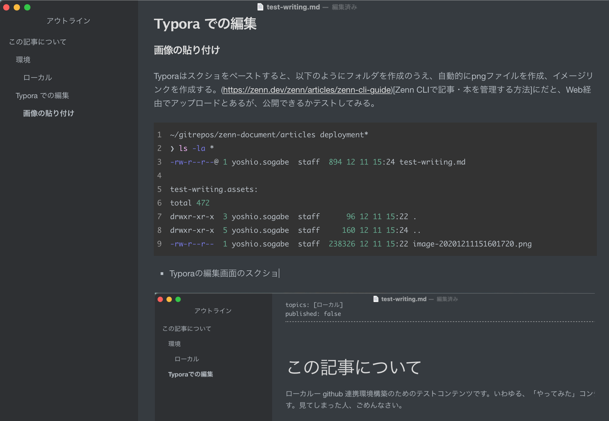
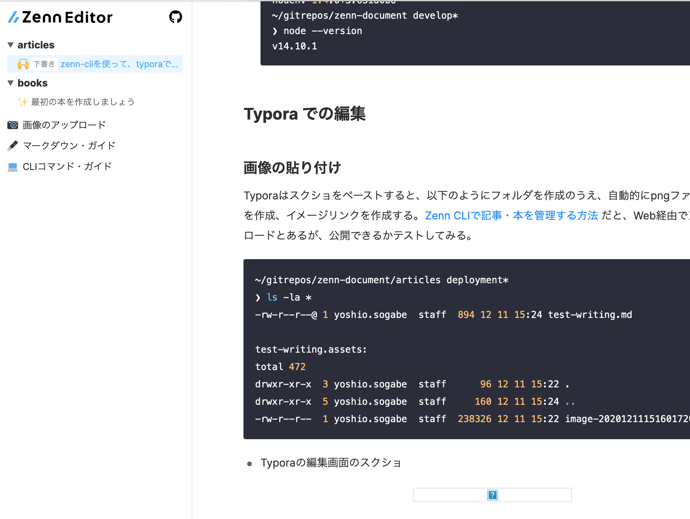

# この記事について

ローカルー github 連携環境構築のためのテストコンテンツです。いわゆる、「やってみた」コンテンツ以下の内容です。見てしまった人、ごめんなさい。

## 環境

### ローカル

- VSCode

- nodenv
  ```bash
  ~/gitrepos/zenn-document develop*
  ❯ anyenv --version
  anyenv 1.1.2
  ~/gitrepos/zenn-document develop*
  ❯ nodenv --version
  nodenv 1.4.0+3.631d0b6
  ~/gitrepos/zenn-document develop*
  ❯ node --version
  v14.10.1
  ```

## Typora での編集

### 画像の貼り付け

Typoraはスクショをペーストすると、以下のようにフォルダを作成のうえ、自動的にpngファイルを作成、イメージリンクを作成する。[Zenn CLIで記事・本を管理する方法](https://zenn.dev/zenn/articles/zenn-cli-guide) だと、Web経由でアップロードとあるが、公開できるかテストしてみる。

```bash
~/gitrepos/zenn-document/articles deployment*
❯ ls -la *
-rw-r--r--@ 1 yoshio.sogabe  staff  894 12 11 15:24 test-writing.md

test-writing.assets:
total 472
drwxr-xr-x  3 yoshio.sogabe  staff      96 12 11 15:22 .
drwxr-xr-x  5 yoshio.sogabe  staff     160 12 11 15:24 ..
-rw-r--r--  1 yoshio.sogabe  staff  238326 12 11 15:22 image-20201211151601720.png
```

- Typoraの編集画面のスクショ
  
- npx zenn preview：プレビューには表示されない
  
- github連携でzennに公開

