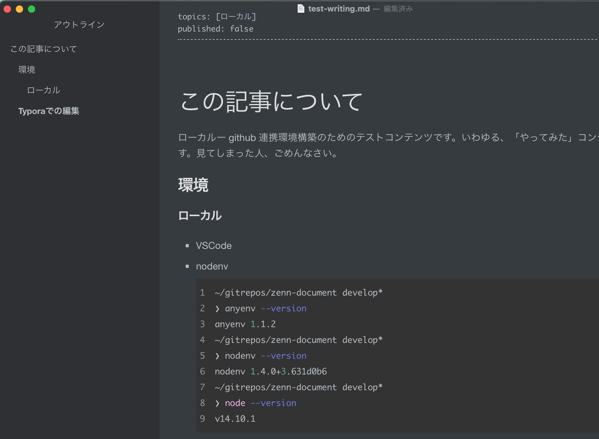

# この記事について

ローカルー github 連携環境構築のためのテストコンテンツです。いわゆる、「やってみた」コンテンツ以下の内容です。見てしまった人、ごめんなさい。

## 環境

### ローカル

- VSCode

- nodenv
  ```bash
  ~/gitrepos/zenn-document develop*
  ❯ anyenv --version
  anyenv 1.1.2
  ~/gitrepos/zenn-document develop*
  ❯ nodenv --version
  nodenv 1.4.0+3.631d0b6
  ~/gitrepos/zenn-document develop*
  ❯ node --version
  v14.10.1
  ```

## Typora での編集


